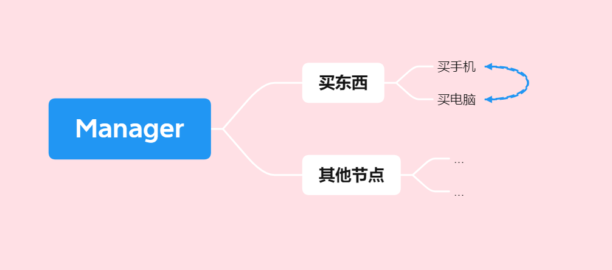

# Bread

\(不知道叫什么  
下一次的输入和上一次的输入是有联系的  
且每个用户之间的输入是互相隔离的  
看示例qwq  

## 结构



## 示例

```csharp
using IlyfairyLib.Utils.Bread;
using System.Text;

//购物节点
var shopNode = new BreadNode()
{
    Condition = (context) =>
    {
        return (context.StartContent as string) == "shop";
    },
    Callback = (context) =>
    {
        context.Context = new StringBuilder();
        Console.WriteLine("欢迎来购物");
        Console.WriteLine("1. 买手机");
        Console.WriteLine("2. 买电脑");
        Console.WriteLine("y 结算");
    }
};

//买手机
var phoneNode = new BreadNode()
{
    Condition = (context) =>
    {
        return (context.StartContent as string) == "1";
    },
    Callback = (context) =>
    {
        var s = context.Context as StringBuilder;
        s.AppendLine("买了一台手机");
        Console.WriteLine("已购买");
        context.Status.Pause(); //停留在shop
    }
};
//买电脑
var computerNode = new BreadNode()
{
    Condition = (context) =>
    {
        return (context.StartContent as string) == "2";
    },
    Callback = (context) =>
    {
        var s = context.Context as StringBuilder;
        s.AppendLine("买了一台电脑");
        Console.WriteLine("已购买"); //输出购买信息
        context.Status.Pause(); //停留在shop
    }
};

//结算
var completeNode = new BreadNode()
{
    Condition = (context) =>
    {
        return (context.StartContent as string) == "y";
    },
    Callback = (context) =>
    {
        var s = context.Context as StringBuilder;
        Console.WriteLine("结算");
        context.Output = s.ToString(); //输出购买信息
    }
};

shopNode.SubNodes.Add(phoneNode);
shopNode.SubNodes.Add(computerNode);
shopNode.SubNodes.Add(completeNode); //按Y结算

BreadManager manager = new(shopNode);

string? input;
while (true)
{
    Console.Write(">>> ");
    input = Console.ReadLine();
    if (input == null) break;
    var result = manager.Run("console", input) as string;
    if(result is not null)
    {
        Console.WriteLine("输出: \n" + result);
    }
}

// output:
/*
    >>> shop
        欢迎来购物
        1. 买手机
        2. 买电脑
        y 结算
    >>> 1
        已购买
    >>> 1
        已购买
    >>> 2
        已购买
    >>> y
        结算
        输出:
        买了一台手机
        买了一台手机
        买了一台电脑
*/
```
